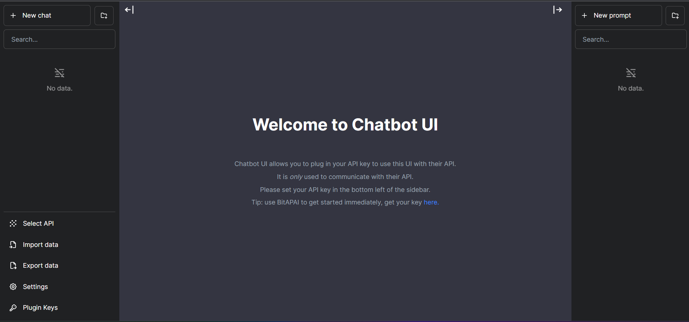

# Chatbot UI

Chatbot UI is an open source chat UI for AI models.



## Updates

Chatbot UI will be updated over time.

Expect frequent improvements.

**Next up:**

- [ ] Langchain Wrapper

## Deploy

**Vercel**

Host your own live version of Chatbot UI with Vercel.

[](https://vercel.com/new/clone?repository-url=https%3A%2F%2Fgithub.com%2Fmckaywrigley%2Fchatbot-ui)

## Adding a new API integration

To add a new API integration in the chat UI, follow these steps.

Add config for your API to the `~/utils/config/models.ts` file

Here are all the available option for config:

- id(string): unique identifier for your api
- name(string): name for your api that user sees on frontend
- endpoint(string): url for your api , used in fetch api's url
- requestBuilder((secret: string, data: any) => RequestInit): function that recieves client's secret key, and data, must return object of type RequestInit, you can format your request's config here, For ex: to add Authorization header with secret key and change the data sending format for the api call.
- responseExtractor((json: any) => string): function that recieves json of the api call's response. You can extract your response that you want to send client (often according to the docs of api you just added), You will mainly extract out the AI's response from the json and return it.
- errorExtractor((json: any) => string): recieves json response of api call, but only in case of error, useful to send back error message from the api.
- defaultPrompt(string): default prompt to be used when not supplied by user for you API.

## Running Locally

**1. Clone Repo**

```bash
git clone https://github.com/crazydevlegend/chatbot-ui.git
```

**2. Install Dependencies**

```bash
npm i
```

**3. Provide BitAPAI API Key**

Create a .env.local file in the root of the repo with your BitAPAI API Key:

```bash
BITAPAI_API_KEY=YOUR_KEY
```

> You can set `BITAPAI_API_HOST` where access to the official BitAPAI host is restricted or unavailable, allowing users to configure an alternative host for their specific needs.

**4. Run App**

```bash
npm run dev
```

**5. Use It**

You should be able to start chatting.

## Configuration

When deploying the application, the following environment variables can be set:

| Environment Variable | Default value          | Description                                              |
| -------------------- | ---------------------- | -------------------------------------------------------- |
| BITAPAI_API_KEY      |                        | The default API key used for authentication with BitAPAI |
| BITAPAI_API_HOST     | https://api.bitapai.io | The default host to make request with BitAPAI            |

If you do not provide an BitAPAI API key with `BITAPAI_API_KEY`, users will have to provide their own key.

If you don't have an BitAPAI API key, you can get one [here](https://bitapai.io).

## Contact

If you have any questions, feel free to reach out to [@crazydevlegend](https://github.com/crazydevlegend)
