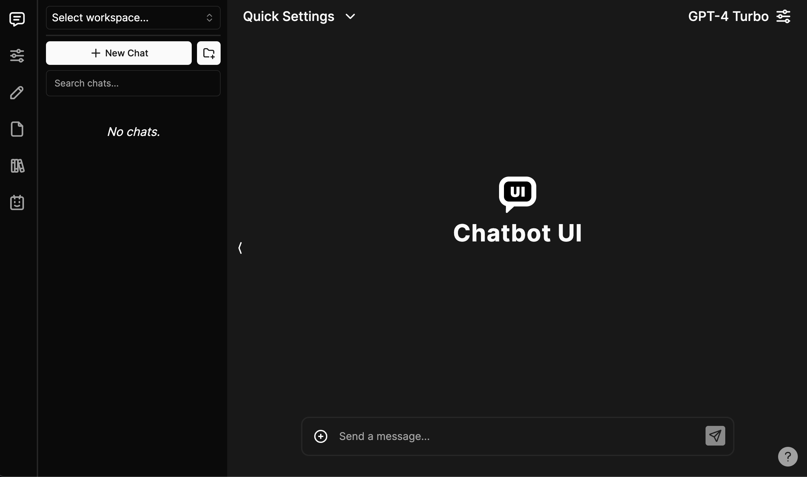

# Chatbot UI

The open-source AI chat app for everyone.



## Demo

View the latest demo [here](https://twitter.com/mckaywrigley).

## Support

If you find Chatbot UI useful, please consider [sponsoring](https://github.com/sponsors/mckaywrigley) me :)

## Local Quickstart

### 1. Clone the repo

```bash
git clone https://github.com/mckaywrigley/chatbot-ui.git
```

### 2. Install dependencies

```bash
npm install
```

### 3. Install Supabase & run locally

1. Install Docker

You will need to install Docker to run Supabase locally. You can download it [here](https://docs.docker.com/get-docker) for free.

2. Install Supabase CLI

```bash
brew install supabase/tap/supabase
```

3. Start Supabase

```bash
supabase start
```

### 4. Install Ollama (for local models)

Follow the instructions [here](https://github.com/jmorganca/ollama#macos).

### 5. Fill in secrets

1. .env

```bash
cp .env.local.example .env.local
```

Get the required values by running:

```bash
supabase status
```

2. sql

In the 1st migration file `20240108234540_setup.sql` you will need to replace 2 values:

- `project_url` (line 53): This can remain unchanged if you don't change your `config.toml` file.
- `service_role_key` (line 54): You got this value from running `supabase status` in step 5.1.

You will also need to to fill in the values for project_url

### 6. Run app locally

```bash
npm run chat
```

## Hosted Quickstart

Check back soon!

## Contributing

We are working on a guide for contributing.

## Contact

Message Mckay on [Twitter/X](https://twitter.com/mckaywrigley)
