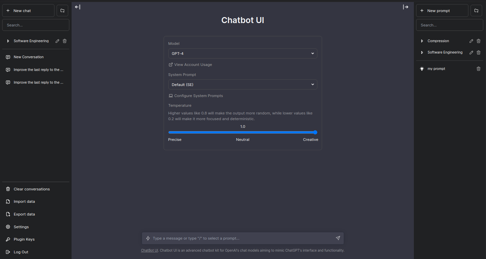

# Chatbot UI

Chatbot UI is an open source chat UI for AI models.

See a [demo](https://twitter.com/mckaywrigley/status/1640380021423603713?s=46&t=AowqkodyK6B4JccSOxSPew).



## Updates

Chatbot UI will be updated over time.

Expect frequent improvements.

**Next up:**

- [ ] Sharing
- [ ] "Bots"

## Deploy

**Vercel**

Host your own live version of Chatbot UI with Vercel.

[](https://vercel.com/new/clone?repository-url=https%3A%2F%2Fgithub.com%2Fjorge-menjivar%2Fchatbot-ui)

**Docker Compose**

Production _(<http://localhost:3000>)_:

```shell
docker-compose -f docker-compose.yml --env-file .env.local up -d
```

Development _(<http://localhost:3001> & <http://localhost:5984/_utils>)_:

```shell
docker-compose -f docker-compose.dev.yml --env-file .env.local up --build
```

**Docker**

Build locally:

```shell
docker build -t chatgpt-ui .
docker run -e OPENAI_API_KEY=xxxxxxxx -p 3000:3000 chatgpt-ui
```

Pull from ghcr:

```
docker run -e OPENAI_API_KEY=xxxxxxxx -p 3000:3000 ghcr.io/mckaywrigley/chatbot-ui:main
```

## Running Locally

**1. Clone Repo**

```bash
git clone https://github.com/mckaywrigley/chatbot-ui.git
```

**2. Install Dependencies**

```bash
npm i
```

**3. Provide OpenAI API Key**

Create a .env.local file in the root of the repo with your OpenAI API Key:

```bash
OPENAI_API_KEY=YOUR_KEY
```

> You can set `OPENAI_API_HOST` where access to the official OpenAI host is restricted or unavailable, allowing users to configure an alternative host for their specific needs.

> Additionally, if you have multiple OpenAI Organizations, you can set `OPENAI_ORGANIZATION` to specify one.

**4. Run App**

```bash
npm run dev
```

**5. Use It**

You should be able to start chatting.

## Configuration

When deploying the application, the following environment variables can be set:

| Environment Variable                  | Default value                                       | Description                                                                                |
| ------------------------------------- | --------------------------------------------------- | ------------------------------------------------------------------------------------------ |
| OPENAI_API_KEY                        |                                                     | The default API key used for authentication with OpenAI                                    |
| OPENAI_API_HOST                       | `https://api.openai.com`                            | The base url, for Azure use `https://<endpoint>.openai.azure.com`                          |
| OPENAI_API_TYPE                       | `openai`                                            | The API type, options are `openai` or `azure`                                              |
| OPENAI_API_VERSION                    | `2023-03-15-preview`                                | Only applicable for Azure OpenAI                                                           |
| OPENAI_ORGANIZATION                   |                                                     | Your OpenAI organization ID                                                                |
| DEFAULT_MODEL                         | `gpt-3.5-turbo` _(OpenAI)_ `gpt-35-turbo` _(Azure)_ | The default model to use on new conversations                                              |
| NEXT_PUBLIC_DEFAULT_SYSTEM_PROMPT     | [see here](utils/app/const.ts)                      | The default system prompt to use on new conversations                                      |
| NEXT_PUBLIC_DEFAULT_TEMPERATURE       | 1                                                   | The default temperature to use on new conversations                                        |
| GOOGLE_API_KEY                        |                                                     | See [Custom Search JSON API documentation][GCSE]                                           |
| GOOGLE_CSE_ID                         |                                                     | See [Custom Search JSON API documentation][GCSE]                                           |
| NEXT_PUBLIC_NEXTAUTH_ENABLED          | `false`                                             | Enable SSO authentication. set 'true' or 'false'                                           |
| NEXTAUTH_EMAIL_PATTERN                |                                                     | The email regex pattern granted access to chatbot-ui                                       |
| NEXTAUTH_URL                          | `http://localhost:3000`                             | NextAuth Settings. See [Official Document](https://next-auth.js.org/configuration/options) |
| NEXTAUTH_SECRET                       |                                                     | NextAuth Settings. See [Official Document](https://next-auth.js.org/configuration/options) |
| GITHUB_CLIENT_ID                      |                                                     | GitHub OAuth Client ID for NextAuth                                                        |
| GITHUB_CLIENT_SECRET                  |                                                     | GitHub OAuth Client Secret for NextAuth                                                    |
| GOOGLE_CLIENT_ID                      |                                                     | Google OAuth Client ID for NextAuth                                                        |
| GOOGLE_CLIENT_SECRET                  |                                                     | Google OAuth Client Secret for NextAuth                                                    |
| STORAGE_TYPE                          | `local`                                             | Options are `local`, `couchdb`, & `rdbms`                                                  |
| COUCHDB_HOST                          | `http://couchdb`                                    | The hostname of the CouchDB instance                                                       |
| COUCHDB_PORT                          | `5984`                                              | The port of the CouchDB instance                                                           |
| COUCHDB_USERNAME                      | `admin`                                             | The username of the CouchDB instance                                                       |
| COUCHDB_PASSWORD                      | `password`                                          | The password of the CouchDB instance                                                       |
| COUCHDB_DATABASE                      | `chatbot`                                           | The database name of the CouchDB instance                                                  |
| RDBMS_DB_TYPE                         | `postgres`                                          | The database type of the RDBMS instance                                                    |
| RDBMS_HOST                            | `127.0.0.1`                                         | The hostname of the RDBMS instance                                                         |
| RDBMS_PORT                            | `5432`                                              | The port of the RDBMS instance                                                             |
| RDBMS_DB                              | `postgres`                                          | The database name of the RDBMS instance                                                    |
| RDBMS_USER                            | `postgres`                                          | The username of the RDBMS instance                                                         |
| RDBMS_PASS                            | `password`                                          | The password of the RDBMS instance                                                         |
| RDBMS_SYNCHRONIZE                     | `true`                                              | Whether to create tables from entities. Should be `false` in production.                   |
| RDBMS_SSL_ENABLED                     | `false`                                             | Whether to require SSL to connect to the database.                                         |
| RDBMS_SSL_HOST                        |                                                     | The hostname of the database server you are connecting to. Google Cloud may require this.  |
| RDBMS_SSL_CA                          |                                                     | The Server CA certificate used for SSL connections, in the form of a single line string.   |
| RDBMS_SSL_CERT                        |                                                     | The Client certificate used for SSL connections, in the form of a single line string.      |
| RDBMS_SSL_KEY                         |                                                     | The Client certificate key used for SSL connections, in the form of a single line string.  |
| RDBMS_COCKROACHDB_TIME_TRAVEL_QUERIES | `false`                                             | Wether to user time travel queries features in CockroachDB                                 |

If you do not provide an OpenAI API key with `OPENAI_API_KEY`, users will have to provide their own key.

If you don't have an OpenAI API key, you can get one [here](https://platform.openai.com/account/api-keys).

### Relational Database Support

If you opt to use a relational database, you must also install the corresponding database driver.
See the corresponding drivers [here](https://github.com/typeorm/typeorm#installation).

## Contact

If you have any questions, feel free to reach out to Mckay on [Twitter](https://twitter.com/mckaywrigley).

[GCSE]: https://developers.google.com/custom-search/v1/overview
